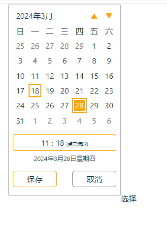

# npm i @cdztt/calendar-vue

## example

```vue
<script setup>
import Calendar from '@cdztt/calendar-vue';
import '@cdztt/calendar-vue/dist/style.css';

const handleCalendarSave = (e) => {
  console.log(e);
};
</script>

<template>
  <Calendar
    placement="topleft"
    color="orange"
    mode="sundayFirst"
    @onSave="handleCalendarSave"
  >
    选择
  </Calendar>
</template>
```



## props

placement:

[ 'top', 'right', 'bottom', 'left', 'topright', 'bottomright', 'bottomleft', 'topleft' ]

color:

[ '#3b3b3b', 'brown', 'green', 'blue', 'orange' ]

mode:

[ 'mondayFirst', 'sundayFirst' ]

## events

onSave:

```javacript
{
  date: 28,
  day: 4,
  dayZh: "四",
  hours: 11,
  minutes: 18,
  month: 3,
  year: 2024,
}
```
